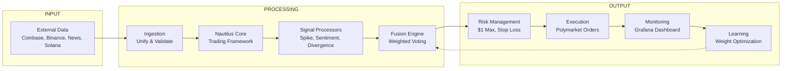

# 🤖 Polymarket BTC 15-Minute Trading Bot

[](https://www.python.org/downloads/)
[](https://nautilustrader.io/)
[](https://opensource.org/licenses/MIT)
[](https://polymarket.com)
[](https://redis.io/)
[](https://grafana.com/)

A production-grade algorithmic trading bot for **Polymarket's 15-minute BTC price prediction markets**. Built with a 7-phase architecture combining multiple signal sources, professional risk management, and self-learning capabilities.

## Kalshi BTC 15-Minute Strategy

This repo also includes a Kalshi-native BTC 15-minute strategy path that runs beside the original Polymarket/Nautilus bot. It reuses the same high-level architecture idea: technical signals from external BTC candles, Kalshi order-book signals, weighted fusion, expected-value filtering, half-Kelly sizing, and risk gates before execution.

The Kalshi path is BTC-first. ETH/SOL can be added later by setting asset-specific series or ticker-prefix env vars and running the scheduler with `--asset`.

### Kalshi Environment

Start from the dedicated template:

```bash
cp .env.kalshi.example .env
```

```env
KALSHI_API_KEY=your_api_key_id
KALSHI_PRIVATE_KEY_PATH=/absolute/path/to/kalshi-private-key.pem
# Or use KALSHI_PRIVATE_KEY with escaped newlines.

KALSHI_DEMO=false
# Production override:
# KALSHI_BASE_URL=https://external-api.kalshi.com/trade-api/v2

KALSHI_BTC_SERIES_TICKER=
KALSHI_BTC_TICKER_PREFIX=
KALSHI_BTC_KEYWORDS=BTC,Bitcoin

KALSHI_CANDLE_PROVIDER=coinbase
KALSHI_DRY_RUN=false
KALSHI_BANKROLL=20.00
KALSHI_MAX_TRADE_DOLLARS=8.00
KALSHI_MAX_TOTAL_EXPOSURE=20.00
KALSHI_MAX_DAILY_LOSS=20.00
KALSHI_EV_THRESHOLD=0.02
KALSHI_FEE_PER_CONTRACT=0.10
KALSHI_KELLY_CAP=0.25
KALSHI_KELLY_MULTIPLIER=0.50
KALSHI_MIN_EDGE_AFTER_FEES=0.05
KALSHI_MAX_SPREAD_CENTS=3
KALSHI_MIN_TOP_DEPTH=5
KALSHI_MIN_MODEL_CONFIDENCE=0.50
KALSHI_MIN_PRICE_CENTS=18
KALSHI_AVG_IN_EDGE_MULTIPLIER=1.5
KALSHI_LATE_TRADE_CUTOFF_SECONDS=60
KALSHI_HARD_LATE_ENTRY_CUTOFF_SECONDS=180
KALSHI_LATE_WINDOW_SECONDS=420
KALSHI_LATE_WINDOW_MIN_EDGE=0.08
KALSHI_LATE_WINDOW_MIN_CONFIDENCE=0.60
KALSHI_MIN_PROBABILITY_GAP=0.05
KALSHI_MIN_MARKET_SIDE_PROB=0.08
KALSHI_MAX_MARKET_SIDE_PROB=0.92
KALSHI_DRAWDOWN_SIZE_REDUCTION_THRESHOLD=0.70
KALSHI_MODEL_PATH=kalshi_probability_model.json
```

### Running Kalshi

```bash
pip install -r requirements-kalshi.txt

# Dry run (no real orders)
python run_kalshi_bot.py --asset BTC

# Live trading, real Kalshi limit orders
python run_kalshi_bot.py --asset BTC --live
```

Set `KALSHI_BTC_SERIES_TICKER` or `KALSHI_BTC_TICKER_PREFIX` before live trading. Keyword discovery is now opt-in only via `KALSHI_ALLOW_KEYWORD_DISCOVERY=true`.

The strategy entrypoint is `run_kalshi_multisignal_strategy()` in `core/strategy_brain/strategies/kalshi_multisignal_strategy.py`. It fetches the active Kalshi contract, retrieves Binance 1-minute BTCUSDT candles, computes RSI/MACD/CCI/Fisher/ADX/ATR plus Kalshi order-book signals, builds a structured feature snapshot, uses `kalshi_probability_model.json` when available, applies edge/spread/depth/confidence filters plus capped half-Kelly sizing, blocks duplicate entries for the same contract, and places a YES or NO limit order when risk gates pass.

### Risk & Logic Changes Since Fork

The following parameters and guards have been changed from the original repo. All values below show the **original** (crossed out) vs **current** (live on Railway).

#### Risk Parameters

| Parameter | Original | Current | Notes |
|-----------|----------|---------|-------|
| `KALSHI_MIN_EDGE_AFTER_FEES` | `0.025` (2.5%) | `0.05` (5%) | Doubled — original was too loose |
| `KALSHI_EV_THRESHOLD` | `0.01` (1%) | `0.02` (2%) | Raised to match edge floor |
| `KALSHI_MIN_MODEL_CONFIDENCE` | `0.20` | `0.50` | Was 0.20; raised to 0.50 for live |
| `KALSHI_LATE_TRADE_CUTOFF_SECONDS` | `90` | `60` | Tighter late-entry window |
| `KALSHI_BANKROLL` | `1000.00` | `20.00` | Live bankroll capped at $20 |
| `KALSHI_MAX_TRADE_DOLLARS` | `25.00` | `8.00` | Max trade reduced to $8 |
| `KALSHI_MAX_TOTAL_EXPOSURE` | `100.00` | `20.00` | Exposure capped at bankroll |
| `KALSHI_MAX_DAILY_LOSS` | `50.00` | `20.00` | Daily loss cap matches bankroll |
| `KALSHI_DRAWDOWN_SIZE_REDUCTION_THRESHOLD` | `0.70` | `0.70` | Unchanged |
| `KALSHI_MAX_SPREAD_CENTS` | `3` | `3` | Unchanged |
| `KALSHI_MIN_TOP_DEPTH` | `5` | `5` | Unchanged |
| `KALSHI_KELLY_CAP` | `0.25` | `0.25` | Unchanged |
| `KALSHI_KELLY_MULTIPLIER` | `0.50` | `0.50` | Unchanged |
| `KALSHI_FEE_PER_CONTRACT` | `0.10` | `0.10` | Unchanged |

#### New Guards Added (not in original)

| Guard | Threshold | Reason |
|-------|-----------|--------|
| `KALSHI_MIN_PRICE_CENTS` | 18¢ minimum | Refuses to buy contracts below 18% odds |
| `KALSHI_AVG_IN_EDGE_MULTIPLIER` | 1.5× | Allows averaging in only when edge exceeds 1.5× the minimum |
| `KALSHI_HARD_LATE_ENTRY_CUTOFF_SECONDS` | 180s | Hard block on entries in last 3 minutes |
| `KALSHI_MIN_PROBABILITY_GAP` | 0.05 | Rejects if model-to-market gap < 5% |
| `KALSHI_MIN_MARKET_SIDE_PROB` | 0.08 | Rejects if market side prob < 8% (tail) |
| `KALSHI_MAX_MARKET_SIDE_PROB` | 0.92 | Rejects if market side prob > 92% (tail) |
| `KALSHI_LATE_WINDOW_SECONDS` | 420s | Separate 7-min late-window edge guard |
| `KALSHI_LATE_WINDOW_MIN_EDGE` | 0.08 (8%) | Late-window edge must exceed 8% |
| `KALSHI_LATE_WINDOW_MIN_CONFIDENCE` | 0.60 | Late-window requires ≥60% model confidence |

#### Logic Changes

- **Telegram alerts** — Original fired on any placed order. Now fires **only when `filled_qty > 0`** and includes `filled_qty` / `remaining_qty`.
- **Averaging in** — Original blocked all re-entries with `already_traded_contract`. Now allows averaging in when edge exceeds `KALSHI_AVG_IN_EDGE_MULTIPLIER × KALSHI_MIN_EDGE_AFTER_FEES` (7.5% with defaults).
- **Duplicate contract blocking** — Original blocked all returnees even if order was unfilled. Now checks Kalshi positions API: if you have no position, blocks; if you have a position, checks edge instead.
- **`OrderResult` dataclass** — Added `filled_qty` and `remaining_qty` fields so Telegram and logging have actual fill data.

#### Removed Guards

| Guard | Original | Notes |
|-------|----------|-------|
| `KALSHI_MIN_EDGE_AFTER_FEES = 0.025` | 2.5% | Replaced by 5% |
| `KALSHI_EV_THRESHOLD = 0.01` | 1% | Replaced by 2% |
| `KALSHI_MIN_MODEL_CONFIDENCE = 0.20` | 0.20 | Replaced by 0.50 |
| `KALSHI_LATE_TRADE_CUTOFF_SECONDS = 90` | 90s | Replaced by 60s |
| `KALSHI_BANKROLL = 1000` | $1000 | Replaced by $20 |

Strategy decisions are appended to `kalshi_trades.jsonl`. Adaptive signal weights are stored in `kalshi_signal_state.json`.

### Kalshi Simulation

```bash
python simulate_kalshi_strategy.py path/to/snapshots.jsonl
python analyze_kalshi_trades.py --log kalshi_trades.jsonl
python train_kalshi_model.py --log kalshi_trades.jsonl --output kalshi_probability_model.json
```

Snapshot rows should contain candle history, a Kalshi-style order book, and a resolved `result` of `yes` or `no`.


---

## 📋 **Table of Contents**
- [Features](#features)
- [Architecture](#architecture)
- [Prerequisites](#prerequisites)
- [Quick Start](#quick-start)
- [Configuration](#configuration)
- [Running the Bot](#running-the-bot)
- [Monitoring](#monitoring)
- [Trading Modes](#trading-modes)
- [Project Structure](#project-structure)
- [Testing](#testing)
- [Contributing](#contributing)
- [FAQ](#faq)
- [License](#license)
- [Disclaimer](#disclaimer)

---

## ✨ **Features**

| Feature | Description |
|---------|-------------|
| **7-Phase Architecture** | Modular, testable, production-ready design |
| **Multi-Signal Intelligence** | Spike Detection, Sentiment Analysis, Price Divergence |
| **Risk-First Design** | $1 max per trade, 30% stop loss, 20% take profit |
| **Dual-Mode Operation** | Toggle between simulation and live without restart |
| **Real-Time Monitoring** | Grafana dashboards + Prometheus metrics |
| **Self-Learning** | Automatically optimizes signal weights based on performance |
| **Auto-Recovery** | WebSocket auto-reconnection, rate limiting, data validation |
| **Paper Trading** | Full P&L tracking in simulation mode |

---

## 🏗️ **Architecture**

### **7-Phase Overview**


## Prerequisites
- Python 3.14+ (Download)

- Redis (Download) - for mode switching

- Polymarket Account with API credentials
- Git

## 🚀 Quick Start

## 1. Clone the Repository

```bash
git clone https://github.com/yourusername/polymarket-btc-15m-bot.git
cd polymarket-btc-15m-bot
```
## 2. Set Up Virtual Environment

```bash
# Windows
python -m venv venv
venv\Scripts\activate

# macOS / Linux
python -m venv venv
source venv/bin/activate
```
## 3. Install Dependencies

```
bash
pip install -r requirements.txt
```
## 4. Configure Environment Variables
```
bash
cp .env.example .env
Edit .env with your credentials:

env
# Polymarket API Credentials
POLYMARKET_PK=your_private_key_here
POLYMARKET_API_KEY=your_api_key_here
POLYMARKET_API_SECRET=your_api_secret_here
POLYMARKET_PASSPHRASE=your_passphrase_here

# Redis Configuration
REDIS_HOST=localhost
REDIS_PORT=6379
REDIS_DB=2

# Trading Parameters
MAX_POSITION_SIZE=1.0
STOP_LOSS_PCT=0.30
TAKE_PROFIT_PCT=0.20
SPIKE_THRESHOLD=0.15
DIVERGENCE_THRESHOLD=0.05
```
## 5. Start Redis
```
bash
# Windows (download from redis.io)
redis-server

# macOS
brew install redis
redis-server

# Linux
sudo apt install redis-server
redis-server
```
## 6. Run the Bot
```
bash
# Test mode (trades every minute - for quick testing)
python run_bot.py --test-mode

# Live trading mode (REAL MONEY!)
python 15m_bot_runner.py --live
```
## ⚙️ Configuration Options
Argument	Description	Default
--test-mode	Trade every minute for testing	False
--live	Enable live trading (real money)	False
--no-grafana	Disable Grafana metrics	False
##View Paper Trades
```
bash
python view_paper_trades.py
```
## Trading Modes
Switch Modes Without Restarting (Redis)

# Switch to simulation mode (safe)
```
python redis_control.py sim -- not stable yet
```
# Switch to live trading mode (REAL MONEY!)
```
python redis_control.py live --not stable yet
``` 
## 📁 Project Structure

```text
polymarket-btc-15m-bot/
├── core/                        # Core business logic
│   ├── ingestion/               # Phase 2: Data ingestion
│   │   ├── adapters/            # Unified adapter interface
│   │   ├── managers/            # Rate limiter, WebSocket manager, etc.
│   │   └── validators/          # Data validation & schema checks
│   ├── nautilus_core/           # Phase 3: NautilusTrader integration
│   │   ├── data_engine/         # Nautilus data engine wrapper
│   │   ├── event_dispatcher/    # Event handling & dispatching
│   │   ├── instruments/         # BTC/USDT instrument definitions
│   │   └── providers/           # Custom live/historical data providers
│   └── strategy_brain/          # Phase 4: Signal generation & processing
│       ├── fusion_engine/       # Multi-signal combination logic
│       ├── signal_processors/   # Individual detectors (spike, divergence, sentiment…)
│       └── strategies/          # Main 15-minute BTC trading strategy
│
├── data_sources/                # Phase 1: External market & sentiment data
│   ├── binance/                 # Binance WebSocket client
│   ├── coinbase/                # Coinbase REST API client
│   ├── news_social/             # Fear & Greed Index + social sentiment
│   └── solana/                  # Solana RPC (optional / experimental)
│
├── execution/                   # Phase 5: Order placement & risk control
│   ├── execution_engine.py      # Main order execution coordinator
│   ├── polymarket_client.py     # Polymarket API wrapper & order logic
│   └── risk_engine.py           # Position sizing, SL/TP, exposure limits
│
├── monitoring/                  # Phase 6: Performance tracking & metrics
│   ├── grafana_exporter.py      # Prometheus metrics exporter
│   └── performance_tracker.py   # Trade logging & statistics
│
├── feedback/                    # Phase 7: Future learning / optimization
│   └── learning_engine.py       # Placeholder for ML feedback loop
│
├── grafana/                     # Grafana dashboard & configuration
│   ├── dashboard.json           # Pre-built dashboard definition
│   ├── grafana.ini              # Grafana server config (optional)
│   └── import_dashboard.py      # Script to import dashboard automatically
│
├── scripts/                     # Development & testing utilities
│   ├── test_data_sources.py
│   ├── test_ingestion.py
│   ├── test_nautilus.py
│   ├── test_strategy.py
│   └── test_execution.py
│
├── .env.example                 # Template for environment variables
├── .gitignore
├── patch_gamma_markets.py       # Temporary patch/fix for Polymarket API
├── redis_control.py             # Switch trading mode (sim/live/test)
├── requirements.txt             # Python dependencies
├── run_bot.py                   # Main bot entry point
├── view_paper_trades.py         # View simulation/paper trade history
└── README.md                    # This file
```
Testing
Run tests for each phase independently:

# Test individual phases
```
python scripts/test_data_sources.py
python scripts/test_ingestion.py
python scripts/test_nautilus.py
python scripts/test_strategy.py
python scripts/test_execution.py
```
🤝 Contributing
Contributions are welcome! Here's how you can help:

 - Fork the repository

 - Create a feature branch: git checkout -b feature

 -Commit your changes: git commit -m 'Added feature'

- Push to the branch: git push origin feature/added-feature

Open a Pull Request

## Ideas for Contributions
- Add derivatives data (funding rates, open interest)

- Implement more signal processors

- Add Telegram/Discord alerts

- Create web UI for management


- Support for ETH/SOL markets

- Machine learning optimization

## ❓ FAQ

**Q: How much money do I need to start?**  
**A:** The bot caps each trade at $1, so you can start with as little as $10–20.

**Q: Is this profitable?**  
**A:** Yes — in simulation testing it has shown good results (e.g. ~75% win rate in early runs).  
However, **past performance does not guarantee future results**. Always test thoroughly in simulation mode first.

**Q: Do I need programming experience?**  
**A:** Basic Python knowledge is helpful (e.g. understanding how to run scripts and edit config files), but the bot is designed to run with just a few simple commands — no coding required for normal use.

**Q: Can I run this 24/7?**  
**A:** Yes! The bot is built for continuous operation and includes basic auto-recovery features in case of temporary connection issues.

**Q: What's the difference between test mode and normal mode?**  
**A:**  
- **Test mode** — trades simulated every minute (great for quick testing and debugging)  
- **Normal mode** — trades every 15 minutes (matches the intended 15-minute strategy timeframe)

 
## Disclaimer
TRADING CRYPTOCURRENCIES CARRIES SIGNIFICANT RISK.

This bot is for educational purposes

Past performance does not guarantee future results

Always understand the risks before trading with real money

The developers are not responsible for any financial losses

Start with simulation mode, then small amounts, then scale up

## Acknowledgments
NautilusTrader - Professional trading framework

Polymarket - Prediction market platform


All contributors and users of this project

## Contact & Community
GitHub Issues: For bugs and feature requests

Twitter: @Kator07

##Discord: Join our community
- https://discord.gg/tafKjBnPEQ

## ⭐ Show Your Support
If you find this project useful, please star the GitHub repo! It helps others discover it.

## contact me on telegram 
 [](https://t.me/Bigg_O7)
